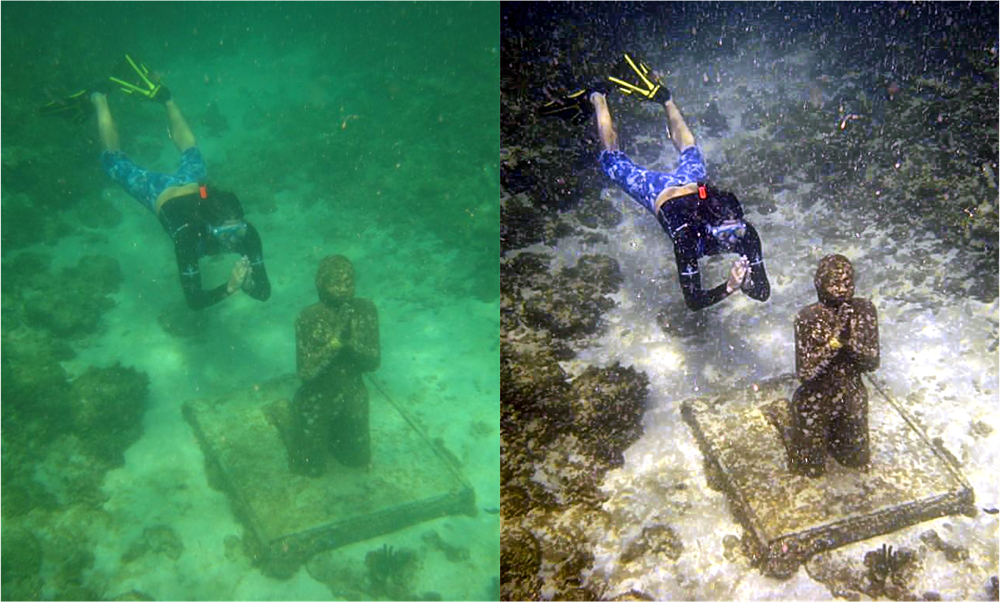

<h1 id="publications"></h1>

<h2 style="margin: 60px 0px -15px;">Preprint</h2>

<ol class="bibliography">




<li>

  

    
            <abbr class="badge">Preprint</abbr>
  

  

      
A New Retinex-based Method for Underwater Image Enhancement

      
<strong>Jiamin Cheng</strong>

      
description description description description

    

      <a href="https://openaccess.thecvf.com/content_CVPR_2019/papers/Sun_Meta-Transfer_Learning_for_Few-Shot_Learning_CVPR_2019_paper.pdf" class="btn btn-sm z-depth-0" role="button" target="_blank" style="font-size:12px;">PDF</a>
      <a href="https://github.com/yaoyao-liu/meta-transfer-learning" class="btn btn-sm z-depth-0" role="button" target="_blank" style="font-size:12px;">Code</a>
      <a href="https://www.bilibili.com/video/BV1Jc411K7Pe?t=12.9" class="btn btn-sm z-depth-0" role="button" target="_blank" style="font-size:12px;">Video</a>
    

  

</li>

</ol>

